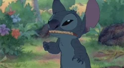

```{r setup, include=FALSE}
options(htmltools.dir.version = FALSE)
knitr::opts_chunk$set(
  fig.showtext = TRUE,
  fig.width = 9, 
  fig.height = 3.5, 
  fig.retina = 3,
  out.width = "100%",
  cache = FALSE,
  echo = TRUE,
  message = FALSE, 
  warning = FALSE,
  hiline = TRUE
)
```

```{r xaringan-themer, include=FALSE, warning=FALSE}
library(xaringanthemer)
library(dplyr)
library(dutchmasters)
library(xaringanExtra)
library(RefManageR)
library(knitr)
library(patchwork)
library(aRtsy)
library(tibble)
library(fs)
palette <- readRDS("data/palette.RDS")

brick <- palette %>% filter(family == "brick", level == 1) 
noil_black <- palette %>% filter(family == "noil_black", level == 1) 
dutch_white <- palette %>% filter(family == "white", level == 40)
acorn <- palette %>% filter(family == "acorn", level == 1)
midnight <- palette %>% filter(family == "midnight", level == 1)
clay <- palette %>% filter(family == "clay", level == 1)
seaweed <- palette %>% filter(family == "seaweed", level == 25)

style_duo_accent(
  # basic colors
  white_color = dutch_white$code,
  black_color = noil_black$code,
  footnote_color = midnight$code,
  text_slide_number_color = midnight$code,
  
  # themed colors
  primary_color = brick$code,
  secondary_color = acorn$code,
  inverse_header_color = "#FFFFFF",
  link_color = seaweed$code,
  link_decoration = "underline",
  
  # typography
  text_font_google = google_font("Quicksand", "400"),
  header_font_google = google_font("Forum","400"),
  inverse_text_color = dutch_white$code,
  text_font_weight = 300,
  text_font_size = "28pt",
  header_font_weight = "400",
  header_h1_font_size = "70pt",
  header_h2_font_size = "50pt",
  header_h3_font_size = "40pt",
  extra_css = list(
    ".subtitle h2" = list("font-size" = "34pt",
                          "font-family" = "var(--text-font-family)",
                          "font-weight" = 300
    ),
    ".date h3, .author h3" = list(
      "font-size" = "30pt",
      "margin" = "0"
    ),
    ".left-column" = list(
      "width" = "50%"
    ),
    ".right-column" = list(
      "width" = "50%"
    ),
    ".remark-slide-content.end-matter.hljs-github p" = list(
      "font-size" = "10pt",
      "line-height" = "1"
    )
  ),
  title_slide_background_image = "../../supporting-materials_files/figure-gfm/watercolor-plot-1.png",
  # etc.
  outfile = "assets/css/xaringan-themer.css"
)


xaringanExtra::use_xaringan_extra(c("tile_view", "banner", "animate"))
```
```{r xaringan-banner, echo=FALSE}
xaringanExtra::use_banner(
  bottom_right = "lizroten.com/slides",
  style_banner(font_size = "20pt",
               text_color = midnight$code))
```

# There are 

---
class: animated fadeInUp fadeOutUp
.pull-left[
### From this...
```{r, out.width = "600px", echo=F}

```
]
---
class: animated fadeInUp fadeOutUp
.pull-right[
### ...to this
```{r, out.width = "380px", out.height="475px", echo=F}
knitr::include_graphics("./assets/fig/tart_icing.gif")
```
]
---
class: inverse center middle

# Project Intake

---
# Assess the damage

- Keep a list of all the things you dislike
- Replicate findings/results
- Find your thing

---
# What is your thing?

find something about this project that you can go all-out. 

Do you like maps? Make the best maps ever  
Do you like plots? Make some gorgeous visualizations
---
class: inverse center middle

# Do and document

---
`r emo::ji("love_letter")`

> Documentation is a love letter to your future self.  - Damien Conway 

---
class: inverse center middle

# Post-project debrief

---
# Leave a gift, not a mystery

---
class: center, middle

# Thanks!
---
class: end-matter

#### Project packages
```{r pkg-refs, split=FALSE, echo=FALSE, warning=FALSE, message=FALSE, results='asis'}
knitr::write_bib(c(.packages()), "assets/packages.bib")
BibOptions(check.entries = TRUE, 
           bib.style = "authoryear",
           sorting = "nty",
           style = "markdown",
           dashed = TRUE)
RefManageR::ReadBib("assets/packages.bib")
```

---
class: end-matter
#### Multimedia sources
<ul style="font-size: 15pt; text-align: left;">

- Stitch https://media.giphy.com/media/BbQrNk32kD064/giphy.gif 
- Mini tart icing https://gfycat.com/needygivingbufeo, as performed by [@jeanimbert](https://www.instagram.com/jeanimbert/?hl=en) 
