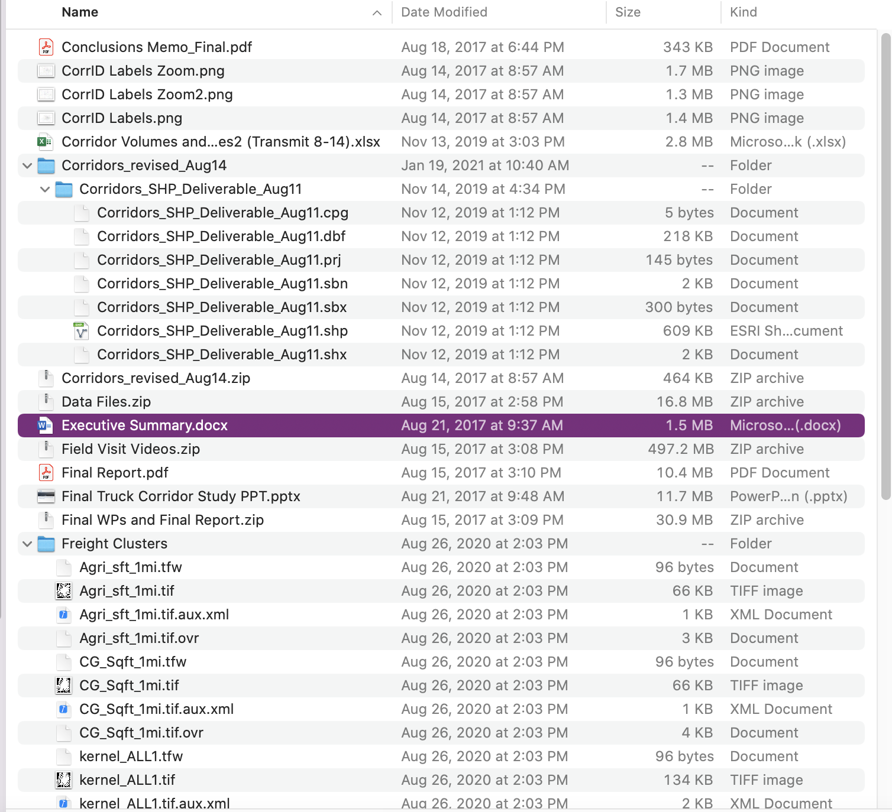
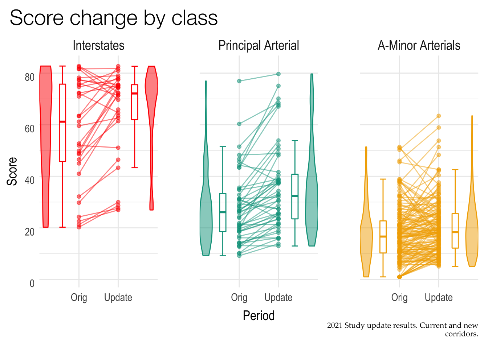
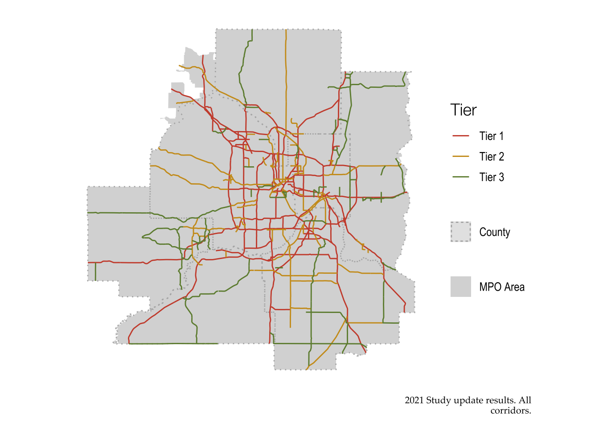
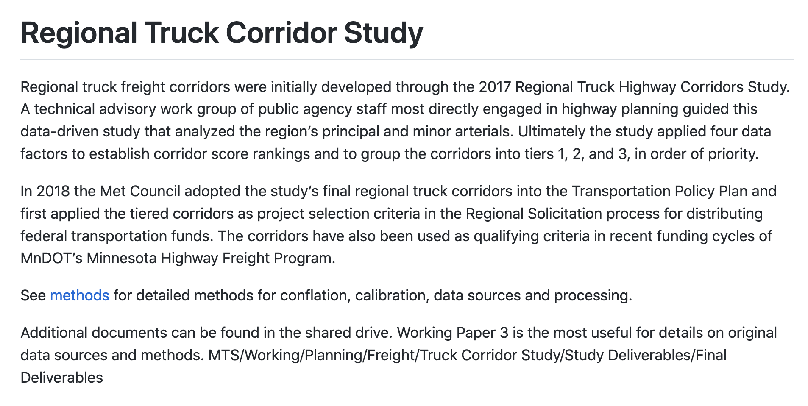
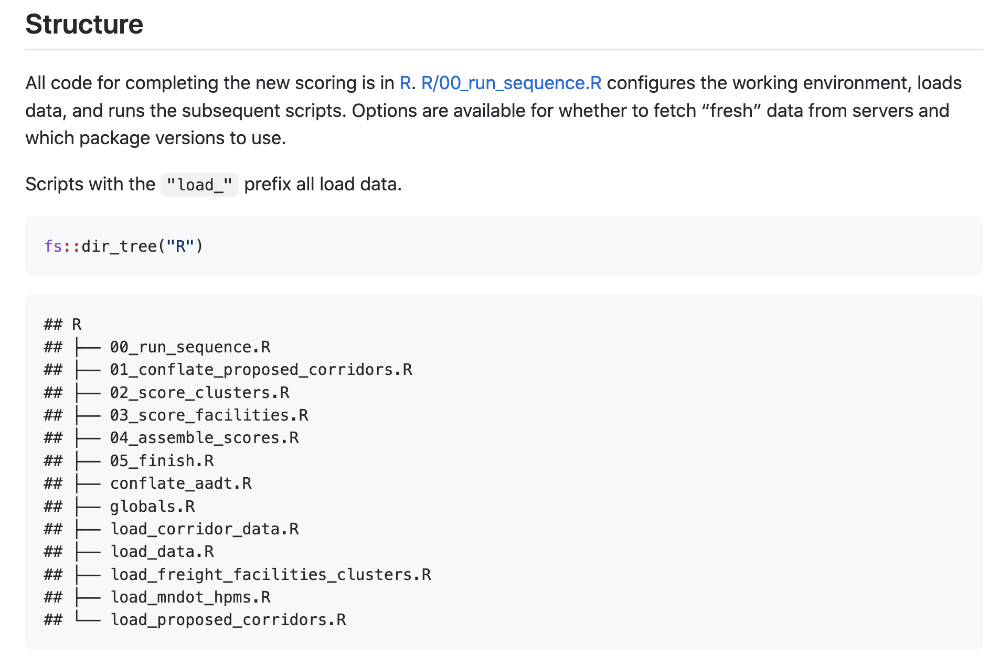
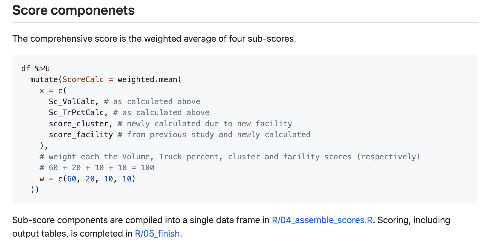

```{r setup, include=FALSE}
options(htmltools.dir.version = FALSE,
        crayon.enabled = TRUE)
knitr::opts_chunk$set(
  fig.showtext = TRUE,
  fig.width = 9, 
  fig.height = 3.5, 
  fig.retina = 3,
  out.width = "100%",
  cache = FALSE,
  echo = TRUE,
  message = FALSE, 
  warning = FALSE,
  hiline = TRUE
)

old_hooks <- fansi::set_knit_hooks(knitr::knit_hooks,
  which = c("output", "message", "error")
)

library(xaringanthemer)
library(dplyr)
library(dutchmasters)
library(xaringanExtra)
library(RefManageR)
library(knitr)
library(patchwork)
library(aRtsy)
library(tibble)
library(fs)
palette <- readRDS("data/palette.RDS")

brick <- palette %>% filter(family == "brick", level == 1) 
noil_black <- palette %>% filter(family == "noil_black", level == 1) 
dutch_white <- palette %>% filter(family == "white", level == 45)
acorn <- palette %>% filter(family == "acorn", level == 1)
midnight <- palette %>% filter(family == "midnight", level == 1)
clay <- palette %>% filter(family == "clay", level == 1)
seaweed <- palette %>% filter(family == "seaweed", level == 25)

```
```{r xaringan-banner, echo=FALSE}
xaringanExtra::use_banner(
  bottom_right = '<a href="https://lizroten.com/oddly" target="_blank" style="color: #5A6E73">lizroten.com/oddly</a>',
  bottom_left = "rstudio::conf(2022)",
  exclude = c("title-slide",
              "inverse"))
```
```{r xaringan-themer, include=FALSE, warning=FALSE}
style_duo_accent(
  # basic colors
  text_slide_number_font_size = 0,
  white_color = dutch_white$code,
  black_color = noil_black$code,
  footnote_color = midnight$code,
  text_slide_number_color = midnight$code,
  
  # themed colors
  primary_color = brick$code,
  secondary_color = acorn$code,
  inverse_header_color = "#FFFFFF",
  link_color = seaweed$code,
  link_decoration = "underline",
  
  # typography
  text_font_google = google_font("Quicksand", "400"),
  header_font_google = google_font("Forum","400"),
  inverse_text_color = dutch_white$code,
  text_font_weight = 300,
  text_font_size = "28pt",
  header_font_weight = "400",
  header_h1_font_size = "70pt",
  header_h2_font_size = "50pt",
  header_h3_font_size = "40pt",
  extra_css = list(
    ".subtitle h2" = list("font-size" = "34pt",
                          "font-family" = "var(--text-font-family)",
                          "font-weight" = 300
    ),
    ".date h3, .author h3" = list(
      "font-size" = "30pt",
      "margin" = "0"
    ),
    ".left-column" = list(
      "width" = "50%"
    ),
    ".right-column" = list(
      "width" = "50%"
    ),
    ".remark-slide-content.end-matter.hljs-github p" = list(
      "font-size" = "10pt",
      "line-height" = "1"
    ),
    ".panel-tabs" = list(
      "font-size" = "35pt"
    ),
    ".panelset .panel-tabs .panel-tab.panel-tab-active" = list(
      "font-weight"= "bold",
      "text-decoration" = "underline",
      "color" = midnight$code
    ),
    "strong" = list(
      "font-weight" = "bold",
      "color" = "var(--text-bold-color)",
      "text-decoration" = "underline"
    ),
    ".pull-right + *" = list(
      "clear"= "none"),
    
    ".xe-banner" = list(
      "color" = midnight$code,
      "font-size" = "0.65em"
    ),
    
    ".inverse > .xe-banner" = list(
      "color" = "transparent"
    ),
    ".inverse a, .inverse a .xe-banner  > code" =
      list(
        "color" = "transparent !important",
        "text-decoration" = "none"
      )
  ),
  title_slide_background_image = "../../supporting-materials_files/figure-html/watercolor-plot-1.png",
  # etc.
  outfile = "assets/css/xaringan-themer.css"
)


xaringanExtra::use_xaringan_extra(c("tile_view", "banner", "animate", "panelset"))
```


.center[
]
<!-- I went to open the existing materials, and -->
--
.center[
## it was bad]
<!-- This project was pitched to me as a quick data science win.  -->
<!-- It would be straightforward, simple, and logical -->
<!-- We are just updating some data -->
<!-- This was a lie.  -->
<!-- In fact, what was left to me was a mess -->
---

## ...how bad?
<!-- You might be asking, why is this so bad? -->
<!-- and because there are so many and you can't read the text, let me describe it -->
<!-- we have several things going on -->
--
.pull-left[

] 
--
.pull-right[
<!-- Which one is *actually* the final one? Is it the most recent chronologically or
the most recently opened or edited? -->
<li>Multiple final reports</li>
]
--
.pull-right[
<!-- some document are marked as revised. but who revised them,
and why were they revised?-->
<li>Multiple revised documents</li>
]
--
.pull-right[
<!-- In this excel document, there are several sheets with interdependent formulas
One sheet has over 15,000 rows! -->
<li>One Excel workbook, with all the analysis</li>
]
<!-- I realized that this project was going to be more than I thought it was
I also got really into this internet phenomenon of oddly satisfying things-->
<!-- what is an oddly satisfying thing? -->

---
## Oddly satisfying  
--
.center[

]

---
--
.pull-left[
### Smoothie!
<video id="smoothie" controls muted height="400px" width="500px"
src="assets/fig/smoothie_satisfying.mp4" type="video/mp4">
</video>]
--
.pull-right[
### Tarts!
<video id="tart-icing" controls muted height="400px" width="500px" src="assets/fig/tart_icing.mp4" type="video/mp4">
</video>]
---
<!-- there is something about this type of video that just calms my soul -->

I decided to take my truck,  
.center[
<br>
<br>
<div>


</div>
]

---
I decided to take my truck, and make it the best truck  
.center[
<div class="center">


</div>
]


---
class: inverse center middle

# Assess the damage
---
## Complete an intake 

--
- Read through everything

---
## Complete an intake 

- Read through everything .primary[-- actually everything]

--

- Make a hate list
<!-- Not of people! Just bad documentation
Maybe the longform documentation doesn't match whats happening in the Excel workbook
Maybe some of the notes are super vague-->
--
<!-- You may find yourself in a place where the long-form PDF documentation doesn't align with what is happening in an Excel workbook -->
<!-- This is the time to resolve that, and start thinking 
about how you want to -->
- Replicate findings/results

--

- Find your ✨thing✨

---
class: center middle animated fadeInUp
<!-- but, most importantly, you must find your thing -->
<div id="thing">
.center.animated.fadeInUp[
## Find your ✨thing✨
]
</div>
---
<!-- Find some aspect of this project you can make shine. -->
.panelset.sideways[
.panel[.panel-name[Plots?]

<!-- finally see what that pretty plot on twitter is all about -->

]
.panel[.panel-name[Maps?]
<!-- prepare to make some bespoke ggplot2 legends -->

] 
.panel[.panel-name[Speed?]
<!-- watch out, because your machine is going to be running *hot* -->
```{r, eval=FALSE}
# Conflate proposed corridors with MnDOT AADT and HCAADT -----
proposed_conflation_match <- purrr::map_dfr(
  1:nrow(all_prop_corridors),
  function(x) {
    first_join <- sf::st_join(all_prop_corridors[x, ] %>%
                                sf::st_transform(26915),
                              aadt %>%
                                unique() %>%
                                sf::st_transform(26915),
                              largest = FALSE,
                              left = TRUE)
    ...
  })
```


]
]

---
Your  ✨thing✨ is what will power the project

--
and keep you sane

---
class: inverse center middle

# Do and document

---

## Complete the work, document along the way

--

> Documentation is a love letter to your future self.  - Damien Conway 

---
### Modularize  
--

No single script more than 500 lines  

--
.pull-left[
<!-- here, we have a bulky script that may do more than we actually need it to  -->
```{r, eval=FALSE}
all_prop_corridors <- corridors %>% 
  filter(proposed == TRUE)
proposed_conflation_match <- purrr::map_dfr(
  1:nrow(all_prop_corridors),
  function(x) {
    first_join <- sf::st_join(
      all_prop_corridors[x, ],
      aadt %>%
        unique(),
      largest = FALSE,
      left = TRUE)
    ...
  })
```
]

--
.pull-right[
<!-- here, we've broken out each script into its core functions.
I can call load_pkgs.R from anywhere, and I know it will JUST call library().
You can also use numeric prefixes 00, 01, 02 to denote sequential operations-->
```{r, eval=FALSE}
source("load_pkgs.R") 
source("load_data.R")
source("01_conflate_corridors.R")
source("02_score_clusters.R")
source("03_score_facilities.R")
```

]
---
### Modularize

No single script more than 500 lines  

.pull-left[
<!-- here, we have a bulky script that may do more than we actually need it to  -->
```{r, eval=FALSE}
all_prop_corridors <- corridors %>% 
  filter(proposed == TRUE)
proposed_conflation_match <- purrr::map_dfr(
  1:nrow(all_prop_corridors),
  function(x) {
    first_join <- sf::st_join(
      all_prop_corridors[x, ],
      aadt %>%
        unique(),
      largest = FALSE,
      left = TRUE)
    ...
  })
```
]

.pull-right[
<!-- here, we've broken out each script into its core functions.
I can call load_pkgs.R from anywhere, and I know it will JUST call library().
You can also use numeric prefixes 00, 01, 02 to denote sequential operations-->
```{r, eval=FALSE}
source("load_pkgs.R") #<<
source("load_data.R")
source("01_conflate_corridors.R")
source("02_score_clusters.R")
source("03_score_facilities.R")
```

]
---

### Modularize

No single script more than 500 lines  

.pull-left[
<!-- here, we have a bulky script that may do more than we actually need it to  -->
```{r, eval=FALSE}
all_prop_corridors <- corridors %>% 
  filter(proposed == TRUE)
proposed_conflation_match <- purrr::map_dfr(
  1:nrow(all_prop_corridors),
  function(x) {
    first_join <- sf::st_join(
      all_prop_corridors[x, ],
      aadt %>%
        unique(),
      largest = FALSE,
      left = TRUE)
    ...
  })
```
]

.pull-right[
<!-- here, we've broken out each script into its core functions.
I can call load_pkgs.R from anywhere, and I know it will JUST call library().
You can also use numeric prefixes 00, 01, 02 to denote sequential operations-->
```{r, eval=FALSE}
source("load_pkgs.R")
source("load_data.R") #<<
source("01_conflate_corridors.R")
source("02_score_clusters.R")
source("03_score_facilities.R")
```

]
---

.panelset[
.panel[.panel-name[Context]
.pull-left[

]

.pull-right[

- What even **is** this thing?

- Why does this thing exist?

- What is the history?  

]

.panel[.panel-name[Structure]
.pull-left[
]

.pull-right[
- How is it organized?
<!-- Please, let there be a system -->
- Where does the data live?

- Where do you actually **do** the thing? 
]
]
.panel[.panel-name[Key]
.pull-left[
]
.pull-right[
- Hate list -> Love list

- At the most fundamental level, what is the operative component and how is it done?

- Link to specific scripts!

]
]

]
]

---

class: inverse center middle

# Leave a gift, 
## not a mystery

---
## Post project debrief

.pull-left[
<video id="gift-video" controls muted height="400px" width="500px" src="assets/fig/leave-a-gift.mp4" type="video/mp4">
</video>
]
--
.pull-right[
- Take a break!

<!-- Once the project is complete, and really truly complete, take a break -->
<!-- - You should be a slightly different person than when you closed the project -->

- Condense and clarify

<!-- - a git commit history is not a sufficient  record-->
]
---

.pull-left[
## Yikes
<!-- here we have all the intermediate rmarkdowns I wrote when I was evaluating the project and conducting the analysis.  -->
<!-- A lot of these were dead ends, and I don't need them taking up space in the future. -->
```{r, results='asis',echo=FALSE}
cat(htmltools::htmlPreserve("&lt;PRE class='fansi fansi-output'&gt;&lt;CODE&gt;## &lt;span style='color: #0000BB; font-weight: bold;'&gt;../../MTS/truck-corridor-study/&lt;/span&gt;
## ├── &lt;span style='color: #00BB00;'&gt;00_sample_corridors.Rmd&lt;/span&gt;
## ├── &lt;span style='color: #00BB00;'&gt;01_conflate_corridors.Rmd&lt;/span&gt;
## ├── &lt;span style='color: #00BB00;'&gt;02_calibrate_streetlight.Rmd&lt;/span&gt;
## ├── &lt;span style='color: #00BB00;'&gt;03_review_streetlight.Rmd&lt;/span&gt;
## ├── &lt;span style='color: #00BB00;'&gt;04_calibrate_fun_classes.Rmd&lt;/span&gt;
## ├── 04_calibrate_fun_classes.html
## ├── &lt;span style='color: #00BB00;'&gt;05_compare_scores.Rmd&lt;/span&gt;
## ├── 05_compare_scores.html
## ├── &lt;span style='color: #00BB00;'&gt;06_generate_deliverables.Rmd&lt;/span&gt;
## ├── 06_generate_deliverables.html
## ├── &lt;span style='color: #0000BB; font-weight: bold;'&gt;06_generate_deliverables_files&lt;/span&gt;
## ├── &lt;span style='color: #00BB00;'&gt;07_review_corridors.Rmd&lt;/span&gt;
## ├── 07_review_corridors.html
## ├── &lt;span style='color: #00BB00;'&gt;08_corridor_additions.Rmd&lt;/span&gt;
## ├── 08_corridor_additions.html
## ├── &lt;span style='color: #0000BB; font-weight: bold;'&gt;R&lt;/span&gt;
## ├── &lt;span style='color: #00BB00; font-weight: bold;'&gt;README.Rmd&lt;/span&gt;
## ├── &lt;span style='color: #00BB00; font-weight: bold;'&gt;README.md&lt;/span&gt;
## ├── &lt;span style='color: #0000BB; font-weight: bold;'&gt;Tableau&lt;/span&gt;
## ├── &lt;span style='color: #0000BB; font-weight: bold;'&gt;data&lt;/span&gt;
## ├── &lt;span style='color: #00BB00; font-weight: bold;'&gt;initial_assessment.Rmd&lt;/span&gt;
## ├── &lt;span style='color: #00BB00; font-weight: bold;'&gt;initial_assessment.html&lt;/span&gt;
## ├── &lt;span style='color: #00BB00; font-weight: bold;'&gt;logo.png&lt;/span&gt;
## ├── &lt;span style='color: #0000BB; font-weight: bold;'&gt;output&lt;/span&gt;
## ├── &lt;span style='color: #00BB00;'&gt;potential_corridor_additions.R&lt;/span&gt;
## ├── &lt;span style='color: #00BB00; font-weight: bold;'&gt;references.bib&lt;/span&gt;
## ├── &lt;span style='color: #0000BB; font-weight: bold;'&gt;scrap&lt;/span&gt;
## ├── &lt;span style='color: #00BB00; font-weight: bold;'&gt;style.css&lt;/span&gt;
## └── &lt;span style='color: #00BB00; font-weight: bold;'&gt;truck-corridor-study.Rproj&lt;/span&gt;
&lt;/CODE&gt;&lt;/PRE&gt;"))
```
]
--
.pull-right[
## Yes
<!-- here, I have dramatically reduced the number of markdowns, down to just three core documents -->
<!-- A README, a Summary, and Methods -->
```{r, results='asis', echo=F}
cat(htmltools::htmlPreserve("&lt;PRE class='fansi fansi-output'&gt;&lt;CODE&gt;## &lt;span style='color: #0000BB; font-weight: bold;'&gt;../../MTS/truck-corridor-study/&lt;/span&gt;
## ├── &lt;span style='color: #0000BB; font-weight: bold;'&gt;R&lt;/span&gt;
## ├── &lt;span style='color: #00BB00; font-weight: bold;'&gt;README.Rmd&lt;/span&gt;
## ├── README.md
## ├── &lt;span style='color: #00BB00;'&gt;Summary.Rmd&lt;/span&gt;
## ├── Summary.html
## ├── &lt;span style='color: #0000BB; font-weight: bold;'&gt;Summary_files&lt;/span&gt;
## ├── &lt;span style='color: #0000BB; font-weight: bold;'&gt;Tableau&lt;/span&gt;
## ├── &lt;span style='color: #0000BB; font-weight: bold;'&gt;data&lt;/span&gt;
## ├── &lt;span style='color: #0000BB; font-weight: bold;'&gt;figures&lt;/span&gt;
## ├── &lt;span style='color: #00BB00; font-weight: bold;'&gt;logo.png&lt;/span&gt;
## ├── &lt;span style='color: #00BB00;'&gt;methods.Rmd&lt;/span&gt;
## ├── methods.html
## ├── &lt;span style='color: #0000BB; font-weight: bold;'&gt;scrap&lt;/span&gt;
## ├── &lt;span style='color: #00BB00; font-weight: bold;'&gt;style.css&lt;/span&gt;
## └── &lt;span style='color: #00BB00; font-weight: bold;'&gt;truck-corridor-study.Rproj&lt;/span&gt;
&lt;/CODE&gt;&lt;/PRE&gt;
"))
```
]
---
## Not only **what**, but **why**

.panelset.sideways[
.panel[.panel-name[What]
<!-- this is a factual statement, but doesn't tell us anything about why we would 2019 over any other year  -->
We used 2019 traffic data
]
.panel[.panel-name[Why]
<!-- here, we add some more context.-->
<!-- 2020 was a dumpster fire, aka, anomalous, year, so we went with 2019.  -->
We used 2019 traffic data __because__ 2020 was anomalous 
]
]

---
## Not only **what**, but **why**

.panelset.sideways[
.panel[.panel-name[What]
<!-- this is a factual statement, but doesn't tell us anything about why we would 2019 over any other year  -->
We set the tier breaks at 15.4 and 26.2 points
]
.panel[.panel-name[Why]
<!-- here, we add some more context -->
We set the tier breaks at 15.4 and 26.2 points __because__ planners used their best judgement
]
]

---
class: center  
# I still don't care about trucks

  

--

but everyone in my office knows about this documentation

--

and I'm very proud of my work.

---
class: center, middle
# Thanks!  

[lizroten.com/oddly](https://lizroten.com/oddly)

---
class: end-matter

#### Project packages
```{r pkg-refs, split=FALSE, echo=FALSE, warning=FALSE, message=FALSE, results='asis'}
knitr::write_bib(c(.packages()), "assets/packages.bib")
BibOptions(check.entries = TRUE, 
           bib.style = "authoryear",
           sorting = "nty",
           style = "markdown",
           dashed = TRUE)
RefManageR::ReadBib("assets/packages.bib")
```

---
class: end-matter
#### Multimedia sources
<ul style="font-size: 15pt; text-align: left;">

- Mini tart icing https://gfycat.com/needygivingbufeo, as performed by [@jeanimbert](https://www.instagram.com/jeanimbert/?hl=en) 
- Satisfying smoothie from [fenitas.nl](https://www.tiktok.com/@fenitas.nl/video/7093892979659738373)
- Tiny crab with tiny fish via [Reddit](https://www.reddit.com/r/oddlysatisfying/comments/vv6g4g/i_dont_know_why_but_this_image_is_so_pleasing/)
- Truck illustration,  MnDOT vehicle classification scheme. Available [here](https://www.dot.state.mn.us/traffic/data/reports/vc/Vehicle_Classification_Scheme.pdf)
- Rainbow illustration: Oren neu dag, [CC BY-SA 3.0](https://creativecommons.org/licenses/by-sa/3.0), via Wikimedia Commons
- Emoji images (Microsoft version) via [Emojipedia](https://emojipedia.org/)