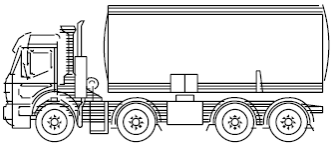

```{r setup, include=FALSE}
options(htmltools.dir.version = FALSE)
knitr::opts_chunk$set(
  fig.showtext = TRUE,
  fig.width = 9, 
  fig.height = 3.5, 
  fig.retina = 3,
  out.width = "100%",
  cache = FALSE,
  echo = TRUE,
  message = FALSE, 
  warning = FALSE,
  hiline = TRUE
)
```

```{r xaringan-themer, include=FALSE, warning=FALSE}
library(xaringanthemer)
library(dplyr)
library(dutchmasters)
library(xaringanExtra)
library(RefManageR)
library(knitr)
library(patchwork)
library(aRtsy)
library(tibble)
library(fs)
palette <- readRDS("data/palette.RDS")

brick <- palette %>% filter(family == "brick", level == 1) 
noil_black <- palette %>% filter(family == "noil_black", level == 1) 
dutch_white <- palette %>% filter(family == "white", level == 40)
acorn <- palette %>% filter(family == "acorn", level == 1)
midnight <- palette %>% filter(family == "midnight", level == 1)
clay <- palette %>% filter(family == "clay", level == 1)
seaweed <- palette %>% filter(family == "seaweed", level == 25)

style_duo_accent(
  # basic colors
  white_color = dutch_white$code,
  black_color = noil_black$code,
  footnote_color = midnight$code,
  text_slide_number_color = midnight$code,
  
  # themed colors
  primary_color = brick$code,
  secondary_color = acorn$code,
  inverse_header_color = "#FFFFFF",
  link_color = seaweed$code,
  link_decoration = "underline",
  
  # typography
  text_font_google = google_font("Quicksand", "400"),
  header_font_google = google_font("Forum","400"),
  inverse_text_color = dutch_white$code,
  text_font_weight = 300,
  text_font_size = "28pt",
  header_font_weight = "400",
  header_h1_font_size = "70pt",
  header_h2_font_size = "50pt",
  header_h3_font_size = "40pt",
  extra_css = list(
    ".subtitle h2" = list("font-size" = "34pt",
                          "font-family" = "var(--text-font-family)",
                          "font-weight" = 300
    ),
    ".date h3, .author h3" = list(
      "font-size" = "30pt",
      "margin" = "0"
    ),
    ".left-column" = list(
      "width" = "50%"
    ),
    ".right-column" = list(
      "width" = "50%"
    ),
    ".remark-slide-content.end-matter.hljs-github p" = list(
      "font-size" = "10pt",
      "line-height" = "1"
    ),
    ".panel-tabs" = list(
      "font-size" = "35pt"
    ),
    ".panelset .panel-tabs .panel-tab.panel-tab-active" = list(
      "font-weight"= "bold",
      "text-decoration" = "underline",
      "color" = midnight$code
    ),
    "strong" = list(
      "font-weight" = "bold",
      "color" = "var(--text-bold-color)",
      "text-decoration" = "underline"
    )
  ),
  title_slide_background_image = "../../supporting-materials_files/figure-html/watercolor-plot-1.png",
  # etc.
  outfile = "assets/css/xaringan-themer.css"
)


xaringanExtra::use_xaringan_extra(c("tile_view", "banner", "animate", "panelset"))
```
```{r xaringan-banner, echo=FALSE}
xaringanExtra::use_banner(
  bottom_right = "lizroten.com/slides",
  style_banner(font_size = "20pt",
               text_color = midnight$code))
```

# I found myself
comparing the number of axels to expected weight in commercial freight trucks in the state of Minnesota 

.center[

]
<!-- This project was pitched to me as a quick data science win.  -->
<!-- It would be straightforward, simple, and logical -->
<!-- We are just updating some data -->
---
## Internet phenomenon, of oddly statisfying things

- objects fitting perfectly into other objects
- perfect cake decoration
- pressure washing very dirty things  

---
class: animated fadeInUp


.pull-left[
### Smoothie!
<video id="smoothie" controls muted height="400px" width="500px">
<source src="assets/fig/smoothie_satisfying.mp4" type="video/mp4">
</video>
]

.pull-right[
### Tarts!
<video id="tart-icing" controls muted height="400px" width="500px">
<source src="assets/fig/tart_icing.mp4" type="video/mp4">
</video>
]
---
class: inverse center middle

# Assess the damage

---
## Complete an intake 

--
- Read through everything - actually, everything

--

- Keep a list of all the things you dislike  

--
<!-- You may find yourself in a place where the long-form PDF documentation doesn't align with what is happening in an Excel workbook -->
<!-- This is the time to resolve that, and start -->
- Replicate findings/results

---
class: center middle animated fadeInUp
<!-- but, most importantly, you must find your thing -->
<div id="thing">
.center.animated.fadeInUp[
## Find your ✨thing✨
]
</div>
---
<!-- Find some aspect of this project you can make shine. -->
.panelset.sideways[
.panel[.panel-name[Plots?]

<!-- finally see what that pretty plot on twitter is all about -->

]
.panel[.panel-name[Maps?]
<!-- prepare to make some bespoke ggplot2 legends -->

] 
.panel[.panel-name[Speed?]
<!-- watch out, because your machine is going to be running *hot* -->
```{r, eval=FALSE}
# Conflate proposed corridors with MnDOT AADT and HCAADT -----
proposed_conflation_match <- purrr::map_dfr(
  1:nrow(all_prop_corridors),
  function(x) {
    first_join <- sf::st_join(all_prop_corridors[x, ] %>%
                                sf::st_transform(26915),
                              aadt %>%
                                unique() %>%
                                sf::st_transform(26915),
                              largest = FALSE,
                              left = TRUE)
    ...
  })
```


  
]
]

---
class: inverse center middle

# Do and document

---

## Complete the work, document along the way

> Documentation is a love letter to your future self.  - Damien Conway 


---
class: inverse center middle

# Leave a gift, not a mystery

---
## Post project debrief

.pull-left[
<video id="gift-video" controls muted height="400px" width="500px">
<source src="assets/fig/leave-a-gift.mp4" type="video/mp4">
</video>
]
.pull-right[
<!-- Once the project is complete, and really truly complete, take a break -->
- You should be a slightly different person than when you closed the project
]
---
## Not only **what**, but **why**

.panelset.sideways[
.panel[.panel-name[What]
<!-- this is a factual statement, but doesn't tell us anything about why we would 2019 over any other year  -->
We used 2019 traffic data
]
.panel[.panel-name[Why]
<!-- here, we add some more context.-->
<!-- 2020 was a dumpster fire, aka, anomalous, year, so we went with 2019.  -->
We used 2019 traffic data __because__ 2020 was anomalous 
]
]

---
## Not only **what**, but **why**

.panelset.sideways[
.panel[.panel-name[What]
<!-- this is a factual statement, but doesn't tell us anything about why we would 2019 over any other year  -->
We set the tier breaks at 15.4 and 26.2 points
]
.panel[.panel-name[Why]
<!-- here, we add some more context -->
We set the tier breaks at 15.4 and 26.2 points __because__ planners used their best judgement
]
]

---
class: center  
# I still don't care about trucks

  

--
  
but everyone in my office knows about this documentation

--

and I'm very proud of my work.

---
class: center, middle
# Thanks!  

https://lizroten.com/oddly

---
class: end-matter

#### Project packages
```{r pkg-refs, split=FALSE, echo=FALSE, warning=FALSE, message=FALSE, results='asis'}
knitr::write_bib(c(.packages()), "assets/packages.bib")
BibOptions(check.entries = TRUE, 
           bib.style = "authoryear",
           sorting = "nty",
           style = "markdown",
           dashed = TRUE)
RefManageR::ReadBib("assets/packages.bib")
```

---
class: end-matter
#### Multimedia sources
<ul style="font-size: 15pt; text-align: left;">

- Stitch https://media.giphy.com/media/BbQrNk32kD064/giphy.gif 
- Mini tart icing https://gfycat.com/needygivingbufeo, as performed by [@jeanimbert](https://www.instagram.com/jeanimbert/?hl=en) 
- Satisfying smoothie from [fenitas.nl](https://www.tiktok.com/@fenitas.nl/video/7093892979659738373)
- Truck illustration,  MnDOT vehicle classification scheme. Available [here](https://www.dot.state.mn.us/traffic/data/reports/vc/Vehicle_Classification_Scheme.pdf)
---

other advice

- general bits of good advice
- specific way that I saw this in this problem
- I got this problem that was easy, but it wasn't -> good hook
- The truck becomes a plot device that can drive the story along
- (maybe this big truck image that follows through)
- most people won't be interested in the truck, 
- "I still don't care about trucks, but everyone in my office, go look at this thing because..."
- in the do-and-document
- show what "we" did.
- start with statements
- here is what we did
- *now* so when you do this, try this thing
- have the image of wrapping something up in a nice little box
- concrete examples
- lean into the part of the person bringing your project
- act into it -> the audience knows where this is going, so you can lean into it. 
- I had to find the exciting stuff. It wasn't that easy, but I made it into a satisfying adventure. 

better off with an "MP4", you get the media control. 
