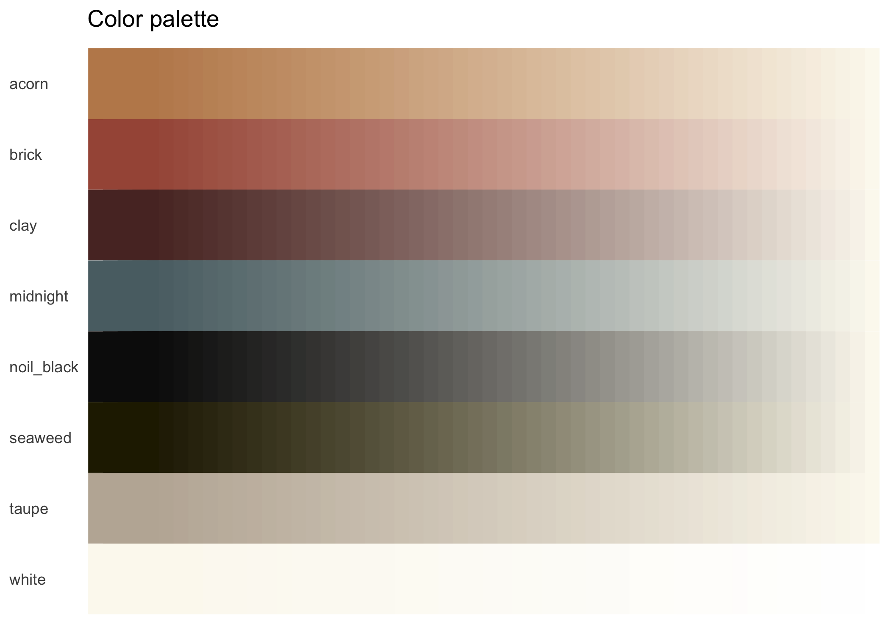
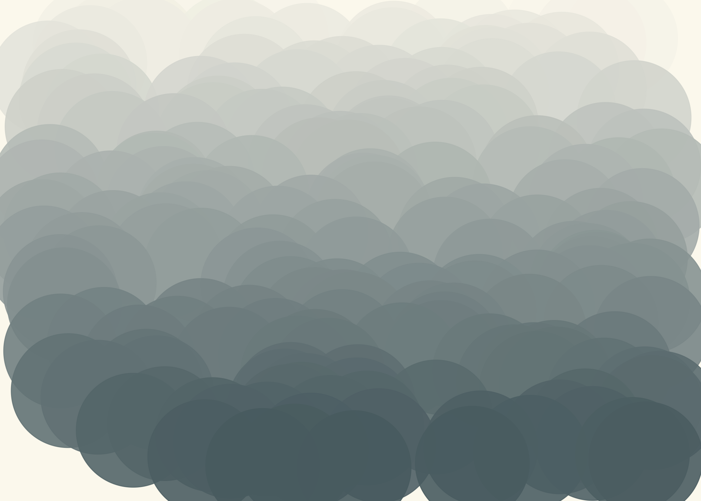
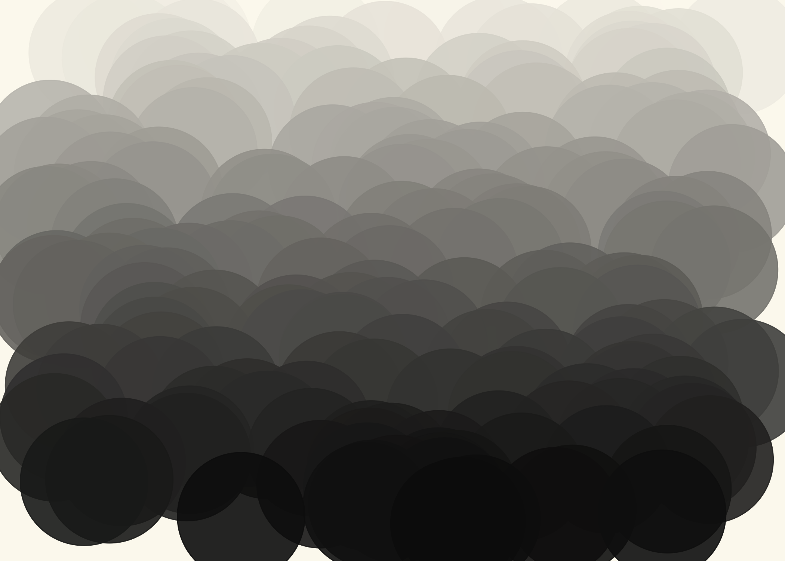
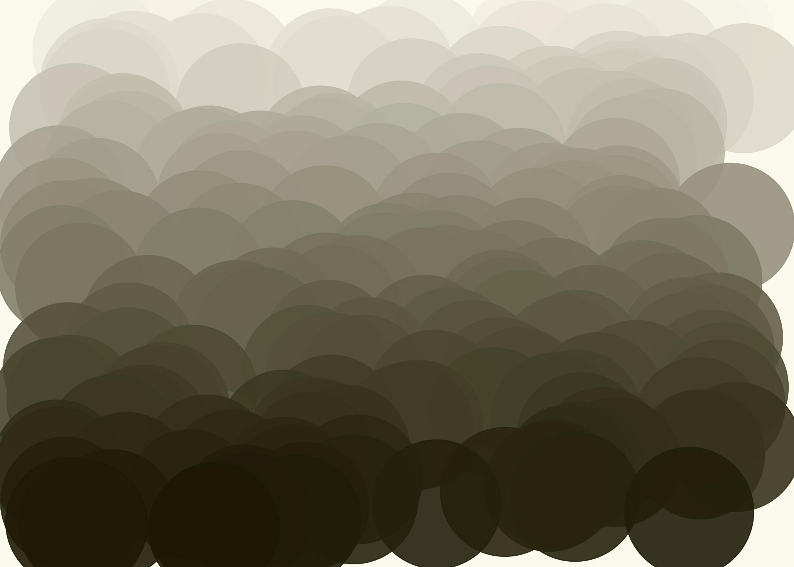
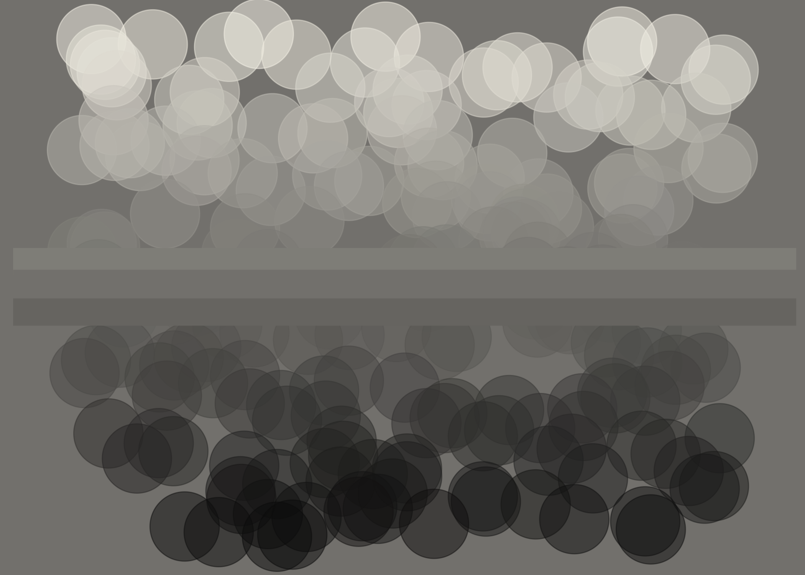
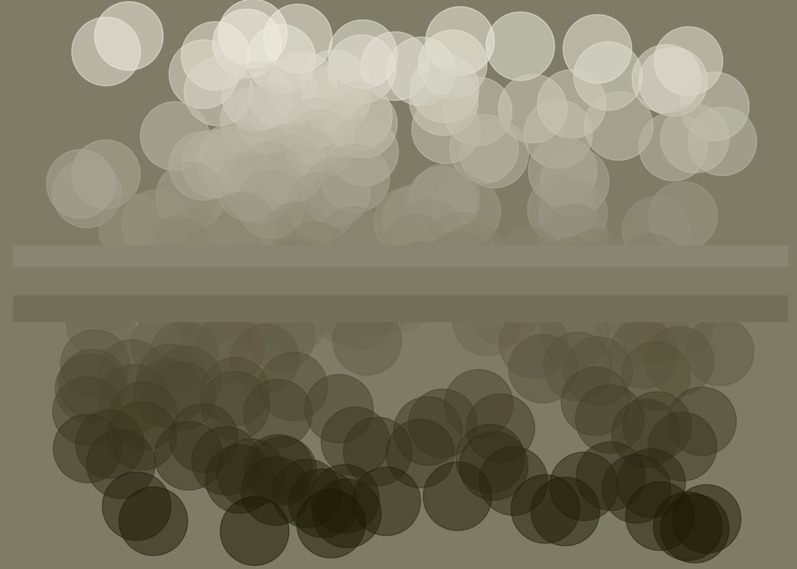

Supporting materials
================
2022-06-23

## Color palette

Colors based on
[`{dutchmasters}`](https://github.com/EdwinTh/dutchmasters), semi.joan’s
[instagram](https://www.instagram.com/semi.joan/), and Blackbird Fabrics
collection of
[linen](https://www.blackbirdfabrics.com/en-us/collections/linen).

<!-- -->

## Intro slide

Some generative aRt ideas?

### Gradients with dots

    ## [[1]]

<!-- -->

    ## 
    ## [[2]]

<!-- -->

    ## 
    ## [[3]]

<!-- -->

    ## 
    ## [[4]]

<!-- -->

    ## 
    ## [[5]]

<!-- -->

    ## 
    ## [[6]]

<!-- -->

    ## 
    ## [[7]]

<!-- -->

    ## [[1]]

<!-- -->

    ## 
    ## [[2]]

<!-- -->

    ## 
    ## [[3]]

<!-- -->

    ## 
    ## [[4]]

<!-- -->

    ## 
    ## [[5]]

<!-- -->

    ## 
    ## [[6]]

<!-- -->

    ## 
    ## [[7]]

<!-- -->

<!-- -->

### Watercolor style abstracts

<!-- -->

## Satisfying gif candidates

<iframe id="reddit-embed" src="https://www.redditmedia.com/r/oddlysatisfying/comments/v4ue9y/this_transition_of_colour/?ref_source=embed&amp;ref=share&amp;embed=true" sandbox="allow-scripts allow-same-origin allow-popups" style="border: none;" height="620" width="640" scrolling="no">
</iframe>
<iframe id="reddit-embed" src="https://www.redditmedia.com/r/oddlysatisfying/comments/uxtpz2/hay_this_is_pretty_satisfying/?ref_source=embed&amp;ref=share&amp;embed=true" sandbox="allow-scripts allow-same-origin allow-popups" style="border: none;" height="620" width="640" scrolling="no">
</iframe>
<iframe id="reddit-embed" src="https://www.redditmedia.com/r/oddlysatisfying/comments/vctpqm/self_aligining_nails_how/?ref_source=embed&amp;ref=share&amp;embed=true" sandbox="allow-scripts allow-same-origin allow-popups" style="border: none;" height="620" width="640" scrolling="no">
</iframe>
<iframe id="reddit-embed" src="https://www.redditmedia.com/r/oddlysatisfying/comments/v4mn16/log_splitting_the_water/?ref_source=embed&amp;ref=share&amp;embed=true" sandbox="allow-scripts allow-same-origin allow-popups" style="border: none;" height="620" width="640" scrolling="no">
</iframe>
<iframe id="reddit-embed" src="https://www.redditmedia.com/r/oddlysatisfying/comments/uw2xah/the_making_of_pastry_art/?ref_source=embed&amp;ref=share&amp;embed=true" sandbox="allow-scripts allow-same-origin allow-popups" style="border: none;" height="620" width="640" scrolling="no">
</iframe>
<iframe id="reddit-embed" src="https://www.redditmedia.com/r/oddlysatisfying/comments/u92s9k/new_warehouse_floor/?ref_source=embed&amp;ref=share&amp;embed=true" sandbox="allow-scripts allow-same-origin allow-popups" style="border: none;" height="620" width="640" scrolling="no">
</iframe>
<iframe id="reddit-embed" src="https://www.redditmedia.com/r/oddlysatisfying/comments/qtqeys/cleaning_up_the_lines/?ref_source=embed&amp;ref=share&amp;embed=true" sandbox="allow-scripts allow-same-origin allow-popups" style="border: none;" height="620" width="640" scrolling="no">
</iframe>
<iframe id="reddit-embed" src="https://www.redditmedia.com/r/oddlysatisfying/comments/taxpo9/i_work_in_a_steel_mill_and_we_were_rolling_one_of/?ref_source=embed&amp;ref=share&amp;embed=true" sandbox="allow-scripts allow-same-origin allow-popups" style="border: none;" height="446" width="640" scrolling="no">
</iframe>

<iframe src="https://gfycat.com/ifr/FlawlessNiftyCatbird" frameborder="0" scrolling="no" width="100%" height="100%" style="position:absolute;top:0;left:0;" allowfullscreen>
</iframe>

<iframe src="https://gfycat.com/ifr/NeedyGivingBufeo" frameborder="0" scrolling="no" width="100%" height="100%" style="position:absolute;top:0;left:0;" allowfullscreen>
</iframe>

